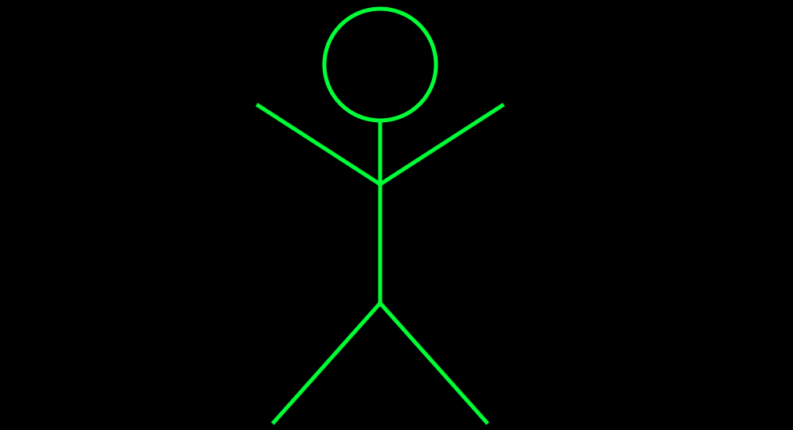

  

# Canvas Stick Figure

Stick figure drawn using **Canvas** made during my Full-Stack Web Developer Bootcamp at [Spiced Academy](https://www.spiced-academy.com/en/program/full-stack-web-development/berlin) in Berlin.  
The stick figure can move around the canvas in response to clicks on arrow keys by the user. Two canvases were used: one on which the stick figure is drawn and another larger canvas on which the first canvas is drawn as an image. Every time the user hits an arrow key, erase what's on the big canvas and redraw the small canvas on it in a new location.

## Technologies

This project was created with the use of two <[canvas](https://developer.mozilla.org/en-US/docs/Web/HTML/Element/canvas)> elements in order to draw 2D graphics in motion.

## Preview

